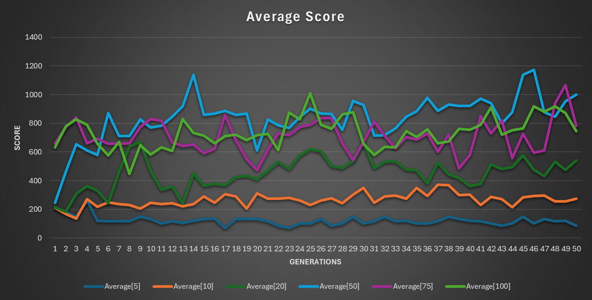

# Dino Bot using NEAT
 This project used [NEAT](https://nn.cs.utexas.edu/downloads/papers/stanley.ec02.pdf "Original NEAT Research") (NeuroEvolution of Augmenting Topologies) an algorithm known for mimicing natural evolution based on the concept of the **Fittest** specimen in order to develop nerual networks to beat the [Google Dinosaur Game](https://chrome-dino-game.github.io/ "Example Game").

 Statistical Analysis was used to determine the most effective population size and Inputs needed to generate the most efficient neural network. 


## Project

### Demo
Coming soon

### Branch Specifications
Multiple branches were formed to store the state of the project at different stages.
1. **NEAT**: This is the default branch which runs the program seen in the Demo and used for the [Results](https://github.com/ArcCreate/DinoBot-NEAT?tab=readme-ov-file#results "Results Section")
2. **AI+ducking**: This branch has an AI which directly branched off the base game and determines it's course of action based on the highest of the 3 outputs (Jump, Duck, Run). The reason this is it's own seperate branch is because as noted in the [Results](https://github.com/ArcCreate/DinoBot-NEAT?tab=readme-ov-file#results "Results Section") section, the dinosaurs were never able to reliably develop a nerual network which allowed them to duck under the high birds and this resulted in stagnation in evolution for 10s of generations. Many different input combinations and population sizes were tried but it always resulted in stagnation of progress. 
3. **BaseGame**: This is the basic GUI implementation of the game which allows you to control the dinosaur as a player. 

---

### How to Replicate Project
1. Make sure your Local Machine has [Python](https://www.python.org/downloads/ "Python Download") installed and an IDE like [VS Code](https://code.visualstudio.com/download "VS Code Download").
2. Clone the repository onto your Local Machine
3. Use a Virtual Enviroment or use the IDE to run the project by running `main.py`
4. For Virtual Machine: First navigate to the derictory where the repo was cloned in the terminal and then use the following code to start the VM, install pygame and run the program:
```bash
    python -m venv venv
    venv\Scripts\activate 
    pip install pygame  
    python main.py
```

## Results

### **Population Analysis**
Testing the optimal population size is important because different populations result in different growth and problems. At high populatin sizes, the first generation generated may end up having an almost perfect solution which results in early stage stagnation which leads to group extinction if the model doesn't improve for a long time. Low population causes have their own problems since they result in a genetic bottleneck which creates stagnation and results in very high standard deviations of growth over multiple trials. 


> Detailed data is available in the DataAnalysis.xlsx and detailed graphs regarding the mean and median of each population are are available below this segment.

* Based on the observational study done regarding population sizes, the most optimal sample size to continue testing [further optimizations](https://github.com/ArcCreate/DinoBot-NEAT?tab=readme-ov-file#NEAT-Implmentation-Optimization) of the NEAT alogrithm is a sample size of **50**. With a not so high sample size, there was less of a chance of generating the optimal solution on the first try and thus resulting in stagnation over the coming generations which was seen in the larger sizes. And a sample size of 50 also prevented stagnation of bad scores because there were enough geneomes with varying mutations and cross over selection produced to advance the neural network after a bad run. Suprisingly this size had the most frequency of tremendously high scores and crossed the 1500 score mark atleast once in every trial.

* As seen from the graph, it is evident that smaller sample sizes, such as 5 and 10 genomes, consistently yield subpar outcomes. The average performance across the trials remained relatively stagnant, with limited improvement and regression occuring over future generations. For instance, in Trial 1 with a sample size of 5, the average score over 50 generations was only 181.6, while Trial 1 with a sample size of 10 had an average score of 211.6. These values were reflected over the other trials done.
  
* Conversely, larger sample sizes like 75 and 100 present their own set of challenges. Despite the initial promise of generating decent dino bots in the first generation, subsequent iterations often lead to stagnation, with minimal permenant score improvents observed over the trials. While one would expect the sample size 100 to generate the highest scoring genome, it was actually the sample size of 50 which generated the best results. Similar to a population size of 100, 75 exhibited similar trends of stagnation towards the middle half of generations, indicating limitations in ability as the high number of speciation relating to large population ended up negating continuous development of the neural network. While sample size 75 maintains consistently high scores, it lacked the pronounced peaks observed in sample sizes 100 and 50, suggesting a failure to explore the full potential of the algorithm.

>Comparison of Means and Medians from all trials regarding each population. 


### **NEAT Implementation Optimization**
Coming Soon


## Resources Used
* [NEAT-Python](https://neat-python.readthedocs.io/en/latest/index.html "Documentation") : NEAT Python Library used from the "AI" of this project
* [Pygame](https://www.pygame.org/news "Pygame Website") : Graphical Interface used to display the Dino game
* [Tutorial](https://www.youtube.com/watch?v=KOBKkPWGP-g&t=2s "YouTube") : Since this is my first use of pygame, this video guided me on how to build the basic framework of the game
  
## Steps to Build Upon
* Modify the NEAT algorithm and fitness function to allow the Dinosaurs to have an option to duck along with jump without causing stagnation. 